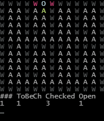

# Grid-Air-Sim
Random idea I got to simulate gas in an 2D array. Nothing fancy just pathfinding and checking if the tile is open or not. The plan is to add the amount of gas in each tile. And how much gas can pass through each tile.

It is super unomptimized, this is as straight forward as it gets.

## What it does
Currently it only simulates one or more specified "outlets". Each iteration it finds the neighbours to the current tile and checks if the are open (tile.gasThroughput > 0).  
Then adds it to the "checkedTiles" array, and to openTiles if it's open.  

### Preview:
  
(delay of 100ms between each iteration)

## Development
```sh
$ git clone https://github.com/Sherex/grid-air-sim.git
$ npm i
```

## License

[MIT](LICENSE)