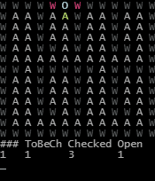

# Grid-Air-Sim
Random idea I got to simulate gas in an 2D array. Nothing fancy just pathfinding and checking if the tile is open or not. It now also simulates gas movements between tiles based on the throughput of each tile.

It is probably unoptimized, but it currently does ~7500 ops/s (in a while loop and not printing to console).

## What it does
Currently it simulates one or more "outlets" on the grid. Each iteration it finds the neighbours to the current tile and checks if they are open (tile.gasThroughput > 0).  
Then adds it to the "checkedTiles" array, and to "openTiles" if it's open.

When it is done checking for open tiles, the outlets begin to push "gas" out to it's open neighbours. Then all open tiles that has more than 0 gas will try to equilize the gas between them. Based on the difference of gas between them and their max throughput.

### Preview:
Legend:  
W - Wall - Grey  
A - Open space - White/Green  
V - Vent (restricted air flow - Magenta  

  
(delay of 100ms between each iteration)

## How to run
```sh
$ git clone https://github.com/Sherex/grid-air-sim.git
$ cd grid-air-sim
$ npm i
```
Edit `index.html` to your liking, for example editing the grid.
```sh
$ npm start
```


## Development
```sh
$ git clone https://github.com/Sherex/grid-air-sim.git
$ cd grid-air-sim
$ npm i
```

## License

[MIT](LICENSE)